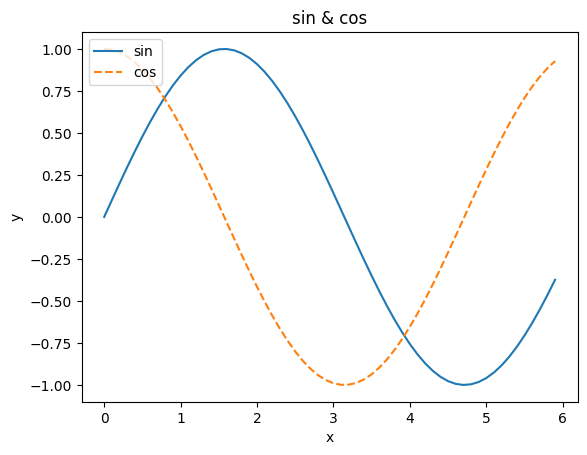
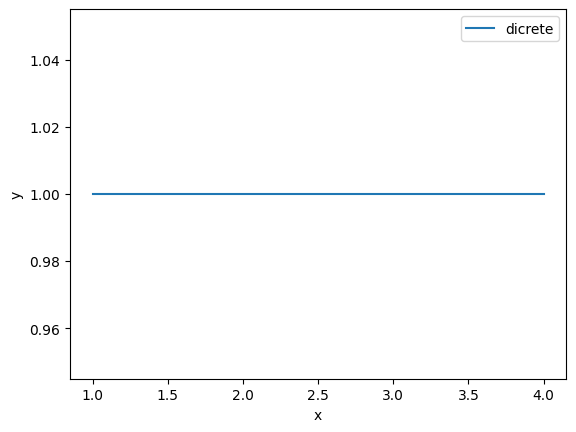

---
title: jupter notebook
date: 2025-01-08
tags: ["python",]
categories: ["notes"]
---------------------

``` python
import numpy as np
x = np.arange(0, 6, 0.1)
y1 = np.sin(x)
y2 = np.cos(x)

import matplotlib.pyplot as plt
plt.plot(x, y1, label='sin')
plt.plot(x, y2, linestyle = '--', label='cos')
plt.xlabel('x')
plt.ylabel('y')
plt.title('sin & cos')
plt.legend(loc="upper left")
plt.show()
```



``` python
different = np.array([1, 2, 3, 4])
different
```

    array([1, 2, 3, 4])

``` python
plt.plot(different, np.ones(4), label = "dicrete")
plt.xlabel("x")
plt.ylabel("y")
plt.legend()
plt.show()
```



``` python
print("testing")
```

    testing
