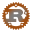

**Welcome to my Blogger,It is a place where I post lots of stuff for computer science and electronic engineer. Enjoy the fun of learning all kinds of stuff.**

## Personal Status
- 😁Interested in full stack. Recent focus on system porgramming
- 🧑‍💻Currently learning Rust, Go, C/C++, Python, Assembly, Compiler Theory, Computor Architecture...
- 📚Love reading book. Intersted in History and Science.
- ⌨️Enjoy Open Source collaboration
- 🔗Write personal blog on this website.

## Social media
-  *Github: https://github.com/BriceLucifer*
-  *X: https://x.com/Bricelucifer*

## Tools

 
 
 
 
 
 

